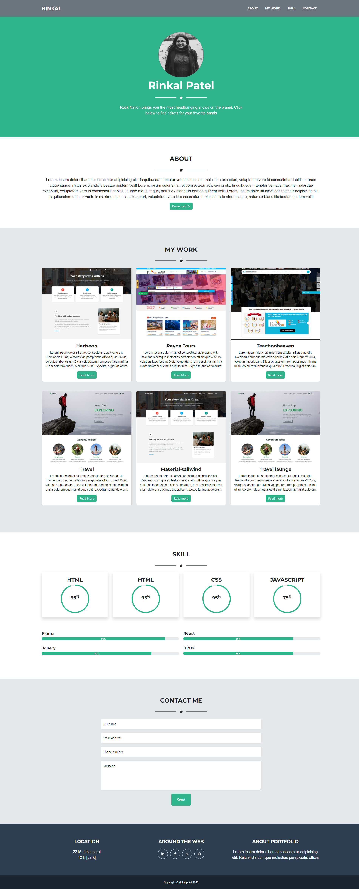

# UX and Advanced CSS: Bootstrap Portfolio


## Description

In this portfolio challnge you can show your skill and talents of your work, and add brief description about yourself. your projects and your contact detail as well,in this project  contain semantic HTML element, structure CSS styling with Bootstrap Grid layout with font-awesome icon.


## Installation

N//A
    
## Usage/Examples

The person who wants to check and learn about bootstrap layout with grid system and how to use bootstrap class and readymade structure with font-awesome and other icons can refer this project. you can review the topics of bootstrap layout and media query from learning website. 
## Screenshots




## Lessons Learned

. I learnd abot how Bootstrap CDNs save developers time during the web development process.

. Code an HTML/CSS webpage using Bootstrap components.

. a fluid layout with the Bootstrap 5 built-in col system.

. Build a desktop layout with three columns in Bootstrap using its built-in 12-column grid and user interface (UI) components.

. Customize the Bootstrap 5 template's UI components.


## Credits
N/A


## Demo

Insert gif or link to demo


## Run Locally

Clone the project

```bash
  git clone https://link-to-project
```

Go to the project directory

```bash
  cd my-project
```

To open in visual studio

```bash
  code .
```


## License

Please refer to the LICENSE in the repo.

